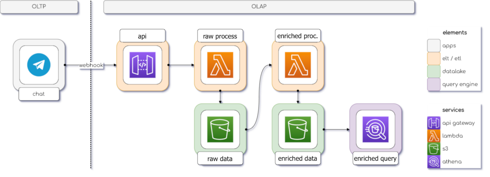

# Projeto-Análise-de-dados-Pipeline-de-dados-telegram

### ⚙️ Arquitetura do Projeto:


### 📋 Sobre o Projeto:
Nesse Projeto será construído um bot do Telegram com dados de Recursos Humanos, trazendo informações a respeito dos funcionários do dataset conforme a categoria escolhida, como veremos logo a seguir. Isso permite que usuários do grupo de RH do Telegram obtenham facilmente informações via bot, tirando a dependência direta do pessoal de dados, aliviando assim, a carga operacional e agilizando processos internos. Além disso, será feito um pipeline de dados com as conversas do Telegram, envolvendo etapas de ingestão de dados, ETL e apresentação no ambiente da Amazon Web Service. E por fim trabalharemos com orientação a coluna em cima do dataset de RH com boas práticas de big data.

📍Clique para fazer o *download* do dataset de [Recursos Humanos](https://www.kaggle.com/datasets/rhuebner/human-resources-data-set).

### 💻 Ambientes utilizados:
<div>
 
 
</div>

### ⌨️ Linguagens utilizadas:
<div>
  
  
</div>

### 📝 Atributos do dataset de RH:

* **Employee_Name**: Nome do funcionário.
* **EmpID**: Identificação única do funcionário.
* **MarriedID**: Indica se o funcionário é casado (1) ou não (0).
* **MaritalStatusID**: Identificação do estado civil do funcionário.
* **GenderID**: Identificação do gênero do funcionário.
* **EmpStatusID**: Identificação do status do emprego do funcionário.
* **DeptID**: Identificação do departamento em que o funcionário trabalha.
* **PerfScoreID**: Identificação do nível de desempenho do funcionário.
* **FromDiversityJobFairID**: Indica se o funcionário participou de uma feira de empregos para diversidade (1) ou não (0).
* **Salary**: Salário do funcionário.
* **Termd**: Indica se o funcionário foi encerrado (1) ou não (0).
* **PositionID**: Identificação do cargo do funcionário.
* **Position**: Cargo do funcionário.
* **State**: Estado em que o funcionário está localizado.
* **Zip**: Código postal do funcionário.
* **DOB**: Data de nascimento do funcionário.
* **Sex**: Sexo do funcionário.
* **MaritalDesc**: Descrição do estado civil do funcionário.
* **CitizenDesc**: Descrição da cidadania do funcionário.
* **HispanicLatino**: Indica se o funcionário é hispânico/latino (Sim ou Não).
* **RaceDesc**: Descrição da raça do funcionário.
* **DateofHire**: Data de contratação do funcionário.
* **DateofTermination**: Data de término do emprego do funcionário (NaN se ainda estiver empregado).
* **TermReason**: Razão para o término do emprego do funcionário.
* **EmploymentStatus**: Status atual de emprego do funcionário.
* **Department**: Departamento em que o funcionário trabalha.
* **ManagerName**: Nome do gerente do funcionário.
* **ManagerID**: Identificação única do gerente do funcionário.
* **RecruitmentSource**: Fonte de recrutamento do funcionário.
* **PerformanceScore**: Pontuação de desempenho do funcionário.
* **EngagementSurvey**: Resultado da pesquisa de engajamento do funcionário.
* **EmpSatisfaction**: Nível de satisfação do funcionário.
* **SpecialProjectsCount**: Contagem de projetos especiais atribuídos ao funcionário.
* **LastPerformanceReview_Date**: Data da última avaliação de desempenho do funcionário.
* **DaysLateLast30**: Número de dias em atraso nos últimos 30 dias.
* **Absences**: Número de faltas do funcionário.

### ✅ Desenvolvimento:

* Verificação da estrutura dos dados e tratamento do dataset de RH para o formato ideal das análises.
* Criação de um bot de Telegram com o uso do botfather e configuração do bot para atender as necessidades do projeto.
* Retorno de funções Python em resposta a interação com o bot do Telegram.
* Captura das mensagens do bot e demais dados com o método `get`.
* Trabalho com três etapas no pipeline:
   * Ingestão
   * ETL
   * Apresentação
* Na etapa de Ingestão envolve coleta, transferência e armazenamento de dados.
   - Criar um *bucket* no `AWS S3`;
   - Criar uma função no `AWS Lambda`;
        - Definir variáveis de ambiente e permissões.
   - Criar uma API *web* no `AWS API Gateway`;
   - Configurar o *webhook* da API de *bots* do **Telegram**.
* Na etapa de ETL envolve extração e transformação dos dados para o usuário final.
   - Criar um *bucket* no `AWS S3` com sufixo `-enriched`;
   - Criar uma função no `AWS Lambda` com sufixo `-enriched`;
        - Definir variáveis de ambiente, permissões, recursos e camadas.
   - criar regra para ativar a funçõe de ETL do `AWS Lambda` no `AWS Event Bridge`;
        - Definir programação para execução da função.
* Na etapa de Apresentação usamos o `AWS Athena` para apresentar para o usuário final informações do bot por meio de consultas `SQL`.
   -  o `AWS Athena` tem função de entregar o dados através de uma interface `SQL` para os usuários do sistema analítico;
   -  Com o dado disponível, usuário podem executar as mais variadas consultas analíticas;
* E por fim foi trabalhado orientação a coluna sobre o dataset de RH com boas práticas de Big Data.
   - Trabalho com o `Apache Parquet`, formato de arquivo **orientado a coluna** mais utilizado no ecossistema de **Big Data**;
   - Uso do `Apache Arrow`, uma estrutura de dados **orientado a coluna** muito utilizada no ecossistema de **big data**;
   - Utilização de `particionamento` de dados bem distribuídos para o armazenamento de grandes volumes de dados;
  
### 📥 Importações Python:

➮ **Google Colab**:

```
import telebot
import pandas as pd
from datetime import datetime
import json
import requests
from IPython.display import Image, display
from getpass import getpass
import os
from pyarrow import csv
import pyarrow as pa
import sys
import seaborn as sns

```
➮ **AWS Lambda**:

```
import os
import json
import logging
from datetime import datetime, timezone
import boto3
from datetime import datetime, timedelta, timezone
import pyarrow as pa
import pyarrow.parquet as pq

```
### 📎 Organização do Projeto:
------------


    ├── requirements.txt          <- O arquivo de requisitos para reproduzir o ambiente de análise, por exemplo, gerado com `pip congelamento > requisitos.txt
    │
    ├── LICENSE
    │
    ├── README.md                 <- O Readme de nível superior para desenvolvedores que usam esse projeto
    │
    ├── architecture.png          <- Arquitetura do projeto de Pipeline de dados   
    │
    ├── Consultas                 <- Referente as consultas SQL realizadas.
    │
    ├── Personalização            <- Contém imagens utilizadas para deixar o caderno apresentável para o usuário.
    │
    ├── Relatórios                <- Coleção de capturas de tela sobre todo o processo de pipeline de dados realizado na Amazon Web Service e Telegram, além de gráficos no google colab.
    │   ├── capturas de tela      <- Coleção de capturas de tela sobre todo o processo de pipeline de dados realizado na Amazon Web Service
    │   ├── graficos              <- Coleção de capturas de gráficos do google colab com python
    │   ├── telegram              <- Coleção de capturas de tela do telegram
    │ 
    ├── documentos                <- datasets utilizados no projeto, incluindo o arquivo original e o arquivo particionado.
    │   ├── dataset.HR.original   <- datasets de recursos humanos original
    │   ├── dataset.HR.particao   <- datasets de recursos humanos modificado
    │
    └──notebook                  <- caderno jupyter notebook utilizado para contrução e apresentação do projeto
    

--------
### 🌐 Referências:

✦ [ebac](https://ebaconline.com.br/)  ✦ [hashtag_programacao](https://youtu.be/_RQw5Nw7Op0?si=VuYOn8Xp9gRkMWho)

